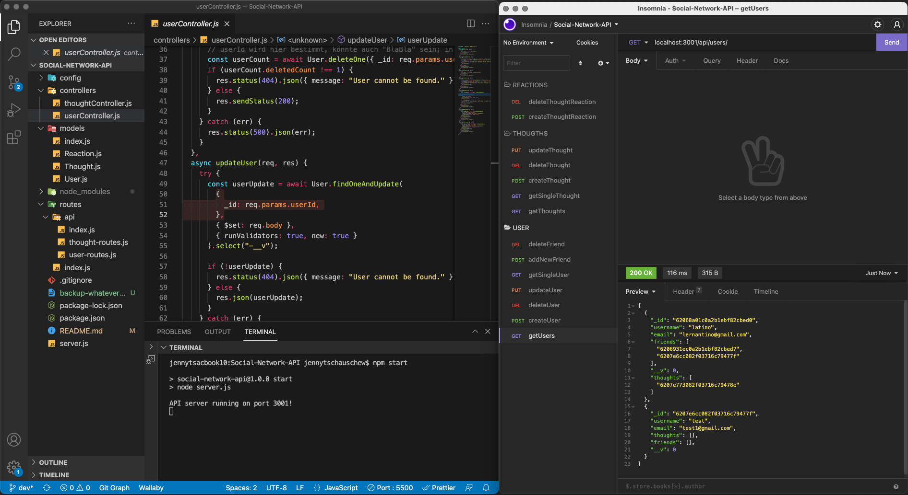

# 18 NoSQL: Social-Network-API

Table of content

- [18 NoSQL: Social-Network-API](#18-nosql-social-network-api)
- [Description](#description)
- [Installation](#installation)
- [Usage / Functionality test via insomnia API design platform](#usage--functionality-test-via-insomnia-api-design-platform)
- [Tech/Framework used](#techframework-used)
- [Repositery content/Building structure + deployed links](#repositery-contentbuilding-structure--deployed-links)

# Description

The repository contains a builded API for a social network web application by using technologies like Express.js for the routing, MongoDB database, npm packages - Express.js, Mongoose, and Javascript. With this API the application can interact with the user as such:

- Checking user (all, single)
- Creating user
- Updating user
- Deleting user
- User can link to other user as friends
- User can delete linked friends
- User can share/create thoughts
- User can check thoughts (all, single)
- User can update and delete thoughts
- User can react to thoughts (comments)
- User can delete reactions on thoughts

# Installation

To make use of the application (in this state) you would need to open (for example) insomnia API design platform to check and play around with the API. For this you must open the code in VS Code, open your insomnia application, create the API requests in insomnia and connecting/active them by entering the respective path, for example: localhost:3001/api/users/

# Usage / Functionality test via insomnia API design platform



# Tech/Framework used

- MongoDB database
- JavaScript
- Node.js
- npm packages: require, express, Mongoose

# Repositery content/Building structure + deployed links

```bash
├── README.md
├── backup-whateverfolder-2022-02-13.txt
├── config
│   └── connection.js
├── controllers
│   ├── thoughtController.js
│   └── userController.js
├── models
│   ├── Reaction.js
│   ├── Thought.js
│   ├── User.js
│   └── index.js
├── node_modules
│   ├── ...
│   │   ├── ...
├── package-lock.json
├── package.json
├── routes
│   ├── api
│   │   ├── index.js
│   │   ├── thought-routes.js
│   │   └── user-routes.js
│   └── index.js
└── server.js
```

- GitHub (dev branch): https://github.com/JenBerlin/Social-Network-API/pull/1
- Walkthrough Video: https://drive.google.com/file/d/1uDXA3lKp52cEmvspV-cMGrTdqMEbpuhu/view?usp=sharing
